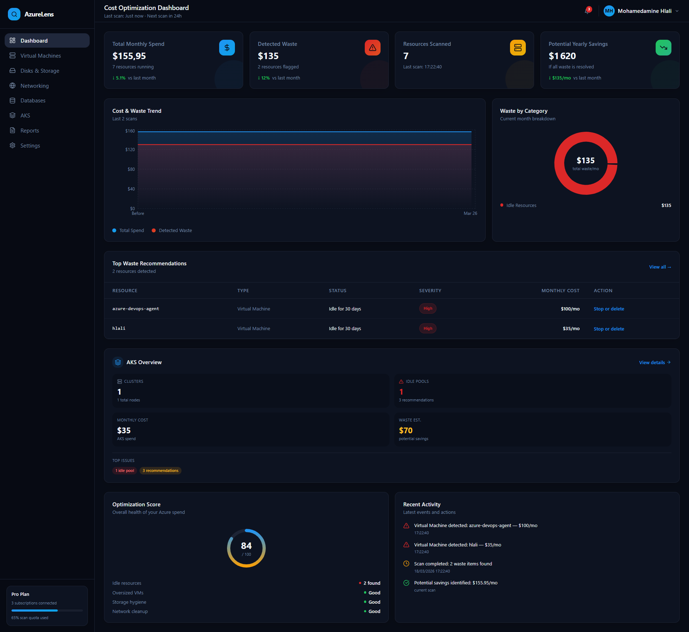
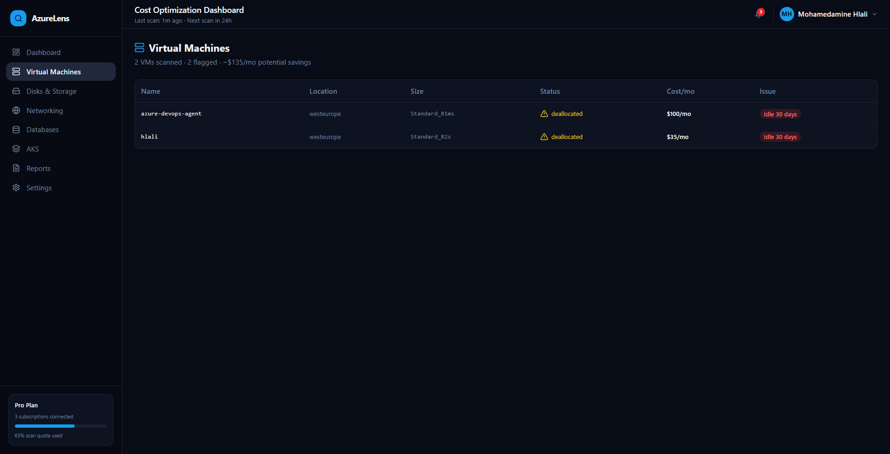
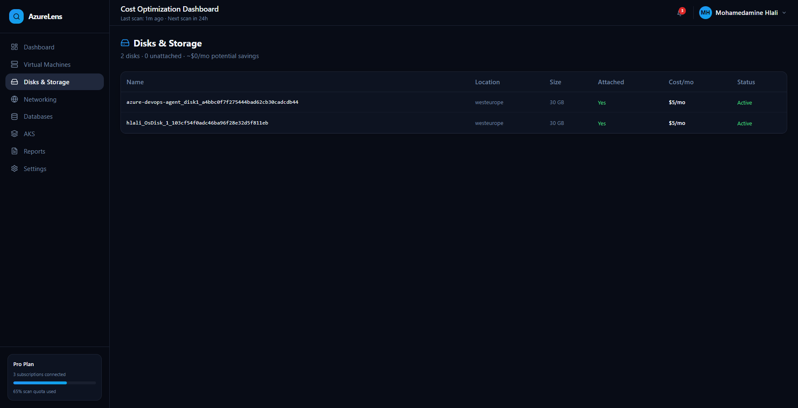
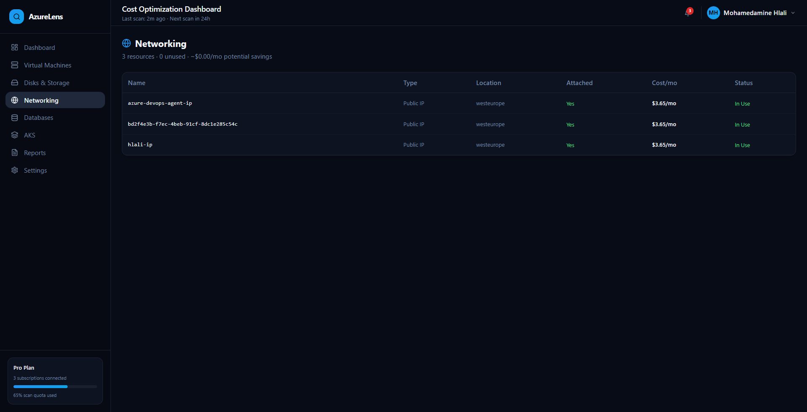
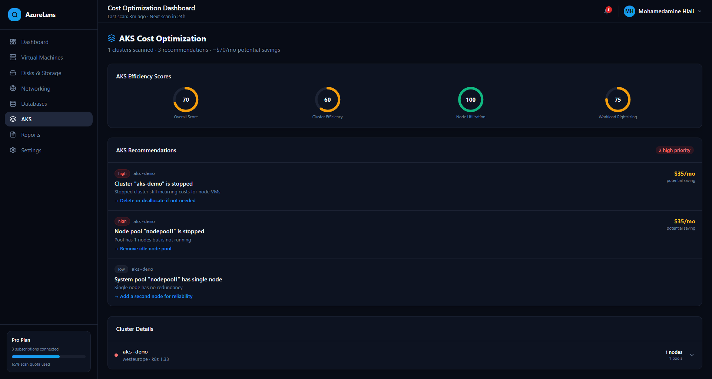
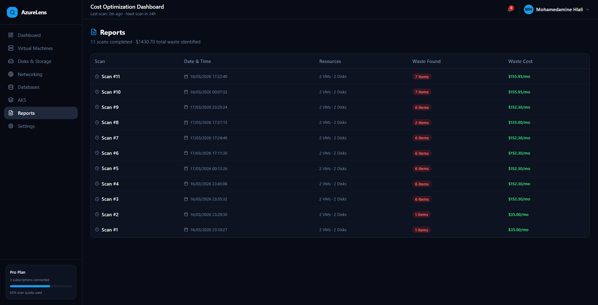
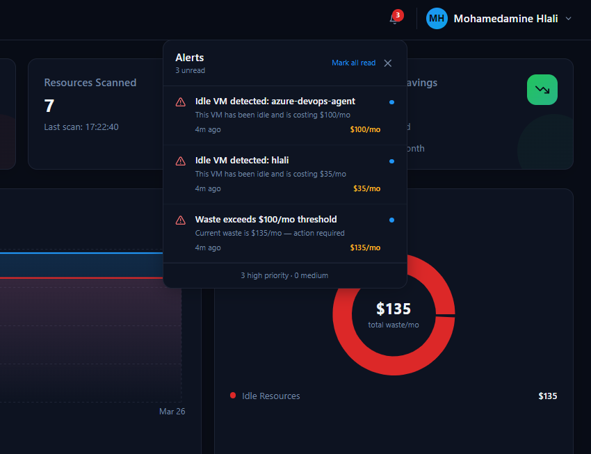
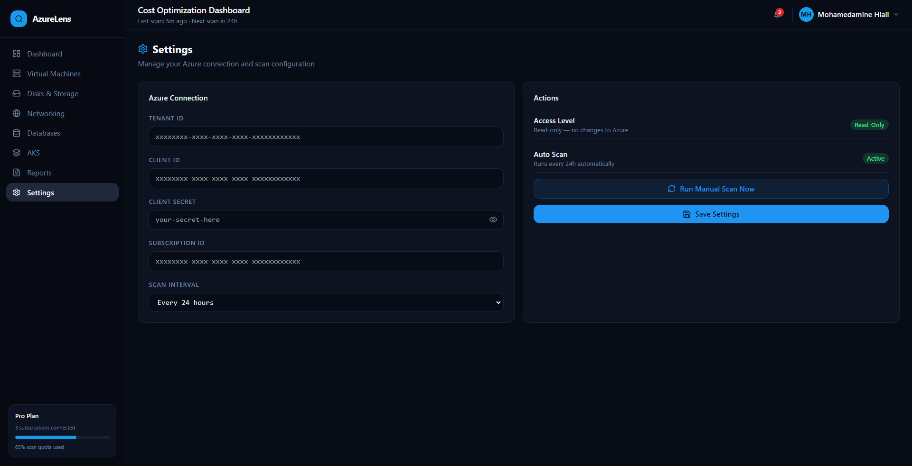

<div align="center">


# AzureLens

### 🔍 Azure Cloud Cost Intelligence Platform

**Detect waste. Eliminate inefficiency. Optimize spend.**

[](LICENSE)
[](https://nodejs.org)
[](https://react.dev)
[](https://www.typescriptlang.org)
[](https://azure.microsoft.com)
[](CONTRIBUTING.md)
[](https://github.com/HlaliMedAmine/azurelens-platform/)

---


---

[**Documentation**](#documentation) · [**Report Bug**](https://github.com/HlaliMedAmine/azurelens-platform/issues) · [**Request Feature**](https://github.com/HlaliMedAmine/azurelens-platform/issues)

</div>

---

## 📋 Table of Contents

- [Overview](#-overview)
- [Features](#-features)
- [Architecture](#-architecture)
- [Screenshots](#-screenshots)
- [Tech Stack](#-tech-stack)
- [Getting Started](#-getting-started)
- [Configuration](#-configuration)
- [API Reference](#-api-reference)
- [Roadmap](#-roadmap)
- [Contributing](#-contributing)
- [License](#-license)

---

## 🌟 Overview

**AzureLens** is an open-source Azure cloud cost optimization platform that automatically detects wasted spending across your Azure infrastructure. It connects securely to your Azure subscription using **read-only credentials**, scans all resources every 24 hours, and surfaces actionable recommendations through a clean, real-time dashboard.

> 💡 Built for **Cloud Architects**, **DevOps Engineers**, **FinOps Teams**, and **CTOs** who want complete visibility into their Azure spend without navigating dozens of Azure Portal blades.

### Why AzureLens?

| Problem | AzureLens Solution |
|---------|-------------------|
| Idle VMs running 24/7 after project end | Detects deallocated & stopped VMs with cost estimates |
| Unattached disks accumulating monthly charges | Identifies orphaned managed disks instantly |
| Unused Public IPs burning budget | Flags unassociated static IPs |
| AKS clusters left running idle | Full Kubernetes cost analysis with efficiency scores |
| No single view of Azure waste | Unified dashboard — one click, full picture |

---

## ✨ Features

### 🏠 Dashboard
Real-time cost overview with live data from your Azure subscription.



- **4 KPI Cards**: Total Monthly Spend · Detected Waste · Resources Scanned · Potential Yearly Savings
- **Cost & Waste Trend**: Real chart built from scan history — grows richer over time
- **Top Waste Recommendations**: Sortable table with severity badges and one-click actions
- **AKS Overview Card**: Quick summary linking to full AKS analysis
- **Optimization Score**: Health score calculated from real waste data
- **Recent Activity**: Live feed of detections and scan completions

---

### 💻 Virtual Machines
Deep analysis of all VMs across your subscription.



- Detects **deallocated** and **stopped** VMs with idle duration
- Cost estimation per VM based on Azure pricing tiers
- Severity classification: Critical / High / Medium / Low
- Direct action links: Stop · Resize · Delete

---

### 💾 Disks & Storage
Find every orphaned managed disk wasting your budget.



- Lists all managed disks with attachment status
- Flags unattached disks with monthly cost
- Shows disk size (GB) and storage tier
- Location-aware: filters by Azure region

---

### 🌐 Networking
Identify unused network resources.



- Scans all **Public IP Addresses** across the subscription
- Detects unassociated Static IPs (charging ~$3.65/mo each)
- Shows association status and monthly cost

---

### ⚓ AKS Cost Optimization
Full Kubernetes cluster cost intelligence.



- **Efficiency Scores**: Overall · Cluster Efficiency · Node Utilization · Workload Rightsizing
- **Smart Recommendations**:
  - Stopped clusters still incurring node VM costs
  - Idle node pools with zero workloads
  - Overprovisioned node counts
  - Single-node system pools with no redundancy
- **Cluster Details**: Expandable view of all node pools with VM size, count, and power state

---

### 📊 Reports
Full scan history with waste tracking over time.



- Complete audit trail of every scan
- Tracks resources scanned, waste items found, and waste cost per scan
- $X total waste identified since onboarding

---

### 🔔 Alerts & Notifications
Real-time alerts delivered directly in the dashboard.



- **Alert types**: Idle VM detected · Unattached disk · Cost threshold exceeded · AKS cluster stopped
- Unread count badge on Bell icon
- Mark individual alerts or all as read
- Auto-refreshes every 5 minutes

---

### ⚙️ Settings
Manage your Azure connection directly from the dashboard — no code editing required.



- Update Tenant ID, Client ID, Client Secret, Subscription ID from the UI
- Configure scan interval (6h / 12h / 24h / 48h)
- Run manual scans on demand
- Changes apply instantly — no server restart needed

---

## 🏗️ Architecture

```
┌─────────────────────────────────────────────────────────────┐
│                        AzureLens                            │
│                                                             │
│  ┌─────────────────┐          ┌──────────────────────────┐  │
│  │   Frontend      │  HTTP    │      Backend             │  │
│  │   React + TS    │ ◄──────► │   Node.js + Express      │  │
│  │   Vite + Tailwind│         │   Port 3001              │  │
│  │   Port 8080     │          │                          │  │
│  └─────────────────┘          │  ┌────────────────────┐  │  │
│                               │  │   Services         │  │  │
│                               │  │  azure.js (VMs,    │  │  │
│                               │  │  Disks, IPs)       │  │  │
│                               │  │  aks.js (Clusters) │  │  │
│                               │  └────────────────────┘  │  │
│                               │           │               │  │
│                               │  ┌────────▼───────────┐  │  │
│                               │  │   SQLite Database  │  │  │
│                               │  │   (sql.js)         │  │  │
│                               │  │   azurelens.db     │  │  │
│                               │  └────────────────────┘  │  │
│                               └──────────┬───────────────┘  │
│                                          │ Azure SDK          │
│                               ┌──────────▼───────────────┐  │
│                               │     Microsoft Azure       │  │
│                               │   ARM APIs (Read-Only)    │  │
│                               │                           │  │
│                               │  • Compute (VMs, Disks)   │  │
│                               │  • Network (Public IPs)   │  │
│                               │  • Container (AKS)        │  │
│                               └───────────────────────────┘  │
└─────────────────────────────────────────────────────────────┘
```

### Data Flow

```
Azure Subscription
      │
      │ (Read-Only credentials via App Registration)
      ▼
  Backend Auto-Scan (every 24h)
      │
      ├── getVirtualMachines()  →  analyzeWaste()
      ├── getManagedDisks()     →  analyzeWaste()
      ├── getPublicIPs()        →  analyzeWaste()
      └── getAKSClusters()     →  analyzeAKSWaste()
                │
                ▼
         SQLite Database
         (resources, scan_history, settings)
                │
                ▼
         REST API (/api/*)
                │
                ▼
         React Dashboard
         (real-time data, no page refresh needed)
```

---

## 📸 Screenshots

<!-- Add your actual screenshots here after taking them -->

| Dashboard | Virtual Machines |
|-----------|-----------------|
|  |  |

| AKS Optimization | Alerts |
|-----------------|--------|
|  |  |

---

## 🛠️ Tech Stack

### Frontend
| Technology | Purpose |
|-----------|---------|
| React 18 | UI framework |
| TypeScript 5 | Type safety |
| Vite 8 | Build tool & dev server |
| Tailwind CSS | Styling |
| Recharts | Charts & visualizations |
| React Router v6 | Client-side routing |
| Lucide React | Icons |

### Backend
| Technology | Purpose |
|-----------|---------|
| Node.js 18+ | Runtime |
| Express.js | HTTP server & API |
| sql.js | SQLite (no native deps) |
| @azure/identity | Azure authentication |
| @azure/arm-compute | VM & Disk scanning |
| @azure/arm-network | Networking resources |
| @azure/arm-containerservice | AKS clusters |
| dotenv | Environment configuration |

---

## 🚀 Getting Started

### Prerequisites

- Node.js 18 or higher
- An Azure subscription
- Azure App Registration with **Reader** role

### 1. Clone the repository

```bash
git clone https://github.com/HlaliMedAmine/azurelens-platform
cd azurelens
```

### 2. Set up Azure credentials

You need an **Azure App Registration** with read-only access:

1. Go to [Azure Portal](https://portal.azure.com) → **App registrations** → **New registration**
2. Name it `azurelens-app` and click **Register**
3. Copy the **Application (client) ID** → this is your `AZURE_CLIENT_ID`
4. Copy the **Directory (tenant) ID** → this is your `AZURE_TENANT_ID`
5. Go to **Certificates & secrets** → **New client secret** → copy the value → `AZURE_CLIENT_SECRET`
6. Go to **Subscriptions** → copy your subscription ID → `AZURE_SUBSCRIPTION_ID`
7. Go to **Subscriptions** → **Access control (IAM)** → **Add role assignment** → assign **Reader** role to your app

### 3. Configure the backend

```bash
cd azurelens-backend
cp .env.example .env
```

Edit `.env`:

```env
AZURE_TENANT_ID=xxxxxxxx-xxxx-xxxx-xxxx-xxxxxxxxxxxx
AZURE_CLIENT_ID=xxxxxxxx-xxxx-xxxx-xxxx-xxxxxxxxxxxx
AZURE_CLIENT_SECRET=your-secret-here
AZURE_SUBSCRIPTION_ID=xxxxxxxx-xxxx-xxxx-xxxx-xxxxxxxxxxxx
PORT=3001
```

### 4. Install dependencies & run

```bash
# Terminal 1 — Backend
cd azurelens-backend
npm install
node index.js

# Terminal 2 — Frontend
cd azurelens  # root directory
npm install
npm run dev
```

### 5. Open the dashboard

```
http://localhost:8080
```

Sign in with any email and password (4+ characters). The first auto-scan will run immediately.

---

## ⚙️ Configuration

### Environment Variables

| Variable | Required | Description |
|----------|----------|-------------|
| `AZURE_TENANT_ID` | ✅ | Azure Active Directory Tenant ID |
| `AZURE_CLIENT_ID` | ✅ | App Registration Client ID |
| `AZURE_CLIENT_SECRET` | ✅ | App Registration Client Secret |
| `AZURE_SUBSCRIPTION_ID` | ✅ | Target Azure Subscription ID |
| `PORT` | ❌ | Backend port (default: 3001) |

### Scan Interval

The backend auto-scans every 24 hours by default. You can change this from the **Settings** page in the dashboard, or modify `index.js`:

```javascript
const SCAN_INTERVAL = 24 * 60 * 60 * 1000; // 24 hours in ms
setInterval(runAutoScan, SCAN_INTERVAL);
```

---

## 📡 API Reference

| Method | Endpoint | Description |
|--------|----------|-------------|
| `GET` | `/api/summary` | Dashboard KPIs: total cost, waste, resources |
| `GET` | `/api/waste` | All waste items (idle, unattached, unused) |
| `GET` | `/api/resources` | All scanned resources |
| `GET` | `/api/aks` | AKS clusters, recommendations & scores |
| `GET` | `/api/alerts` | Active alerts (idle VMs, cost threshold, AKS) |
| `GET` | `/api/history` | Scan history log |
| `POST` | `/api/scan` | Trigger a manual scan |
| `GET` | `/api/settings` | Current configuration |
| `POST` | `/api/settings` | Update Azure credentials & config |

### Example Response — `/api/summary`

```json
{
  "totalMonthlyCost": 155.95,
  "wasteMonthlyCost": 135.00,
  "totalYearlyCost": 1620,
  "totalItems": 2,
  "totalResources": 7,
  "breakdown": [
    { "waste_type": "idle", "count": 2, "cost": 135 }
  ],
  "lastScannedAt": "2026-03-18T00:07:32.000Z"
}
```

---

## 🗺️ Roadmap

- [x] Virtual Machine waste detection
- [x] Managed Disk analysis
- [x] Public IP scanning
- [x] AKS cluster optimization
- [x] Real-time alerts (Bell icon)
- [x] Scan history & trend charts
- [x] Settings management from UI
- [x] Authentication (login/logout)
- [ ] Email reports (weekly digest)
- [ ] Export to PDF / Excel
- [ ] Multi-subscription support
- [ ] Azure Database scanning (SQL, Cosmos DB, PostgreSQL)
- [ ] GitHub Actions CI/CD
- [ ] Docker support
- [ ] Slack / Teams notifications
- [ ] Microsoft Azure AD SSO

---

## 🤝 Contributing

Contributions are what make the open-source community amazing. Any contribution you make is **greatly appreciated**.

See [CONTRIBUTING.md](CONTRIBUTING.md) for detailed guidelines.

### Quick contribution guide

1. Fork the project
2. Create your feature branch: `git checkout -b feature/AmazingFeature`
3. Commit your changes: `git commit -m 'Add AmazingFeature'`
4. Push to the branch: `git push origin feature/AmazingFeature`
5. Open a Pull Request

### Good first issues

Looking for ways to contribute? Check issues tagged [`good first issue`](https://github.com/HlaliMedAmine/azurelens-platform/issues?q=label%3A%22good+first+issue%22).

---

## 🔒 Security

AzureLens uses **read-only** Azure credentials. It **never** modifies, creates, or deletes any Azure resources. All credentials are stored locally in your `.env` file and never transmitted to any third party.

> ⚠️ **Important**: Never commit your `.env` file to version control. It is included in `.gitignore` by default.

---

## 📄 License

Distributed under the MIT License. See [LICENSE](LICENSE) for more information.

---

## 👨‍💻 About the Author

**Mohamed Amine Hlali**  
Azure & DevOps Engineer | AKS | Terraform | Cloud Architecture  

- 🌐 Website: http://mohamedaminehlali.cloud
- 💼 LinkedIn: https://www.linkedin.com/in/mohamed-amine-hlali  
- 🧠 GitHub: https://github.com/HlaliMedAmine  

---

## ⭐ Show your support

If AzureLens helped you save money on Azure, please consider giving it a ⭐ on GitHub — it helps the project grow and reach more engineers!

---

<div align="center">

**Built with ❤️ for the Azure & DevOps community**

*If you're from Microsoft and reading this — I'd love to discuss cloud cost optimization further 🙂*

</div>
